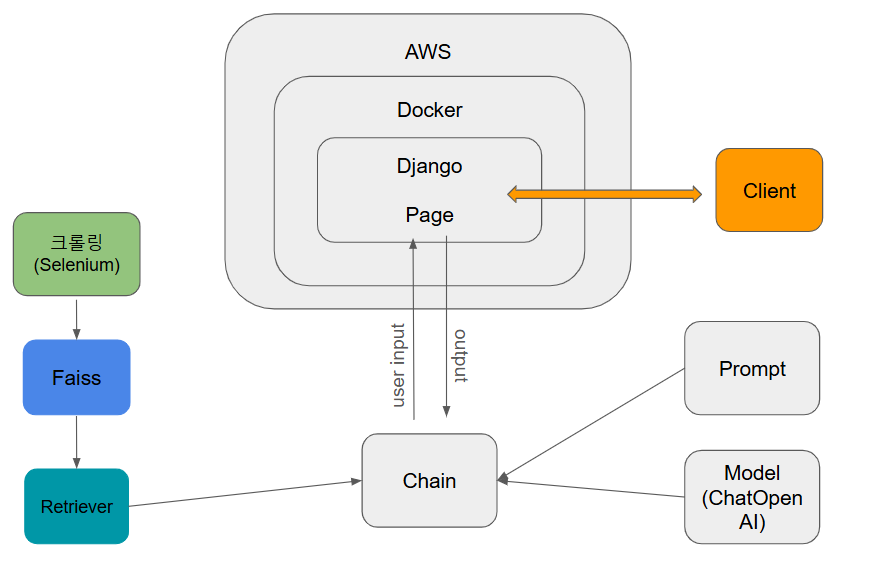

# 🤗 팀명 : 구른다
 
### 🤭 팀원

<p align="center">
  <table>
	<tr>
	  <td align="center">
		<br>오종수 [팀장]
	  </td>
	  <td align="center">
		<br>김효은
	  </td>
	  <td align="center">
		<br>박병헌
	  </td>
	  <td align="center">
		<br>김정훈
	  </td>
	  <td align="center">
		<br>이지수
	  </td>
	</tr>
  </table>
</p>

### 💼 역할 분담

### 👨‍💻 김정훈
- **Backend**: Streamlit으로 구현된 페이지를 Django로 이식함 (공동작업)
- **Frontend**: Streamlit으로 구현된 페이지를 html 형식으로 변경  (공동작업)
- **test 코드 작성** : 구현된 페이지를 테스트하는 코드 작성
### 👨‍💻 박병헌
- **상세 페이지 설계서 작성** : Django로 페이지를 이식하기 위한 상세 페이지 설계서 작성
- **Backend**: Streamlit으로 구현된 페이지를 Django로 이식함  (공동작업)
- **Frontend**: Streamlit으로 구현된 페이지를 html 형식으로 변경 (공동작업)
- **README 작성** 

### 👩‍💻 이지수
- **요구사항 정의서 작성** : Django로 페이지를 이식하기 위한 요구사항 정의서 작성
- **AWS 배포**: Django로 제작된 페이지를 AWS환경에서 배포

### 👨‍💻 오종수
- **조장**

---

## 프로젝트 개요
- **상세 페이지 설계서 작성**
- **요구사항 정의서 작성**
- **streamlit으로 구현된 페이지를 django로 이식** 
- **AWS 배포**


이 프로젝트는 다나와 사이트에서 노트북 제품 정보를 **크롤링**하여, 사용자가 입력하는 질문에 대해 할루시네이션이 없는 답변을 제공하는 **대화형 챗봇**  streamlit 페이지를 django로 이식하여 배포까지 진행하는 프로젝트입니다.

## Data

다나와 사이트(https://prod.danawa.com/list/?cate=112758)에서 셀레니움을 통해 크롤링하여 노트북 데이터를 수집 하였습니다. 
<br>
수집한 데이터 : 노트북 모델명, 상세 스펙, 가격


## Preprocess

csv 파일로 저장된 데이터를 document에 저장하여 metadata를 추가하고 contents에 불필요한 문자를 제거하여 정제했습니다.
<br>
정제된 데이터를 'text-embedding-3-small'모델을 사용하여 Faiss DB에 임베딩하여 저장했습니다.

---


## 기술 스텍

| Data Modeling | SCM | Front-End / Back-End | Deploy |
|-----------------|--------|---------------------|------------------|
|    ||  | 

## Prerequisites


### Conda 환경 생성 및 활성화
```
conda env create -f environment.yml
conda activate best_laptop_env
```
---

### .env 환경변수 파일 필요 

<p>

```
OPENAI_API_KEY ="sk-*******************************************************************"
faiss_path ="./data/db"
```

### .env.prod 파일 필요
```
DEBUG=0
SECRET_KEY=****************************************
DJANGO_ALLOWED_HOSTS=localhost ******************* [::1]
SQL_ENGINE=django.db.backends.postgresql
SQL_DATABASE=postgres
SQL_USER=postgres
SQL_PASSWORD=****
SQL_HOST=best-laptop.c****************************
SQL_PORT=5432
```
### .env.prod.db 파일 필요
```
POSTGRES_USER=************************
POSTGRES_PASSWORD=***************************************
POSTGRES_DB=**************************
```


## Usage

AWS 에서 EC2 인스턴스을 만들어 다음 명령어를 입력
```cmd
sudo apt-get update
sudo apt-get install docker.io docker-compose
sudo docker-compose up -d --build
sudo docker-compose exec web python manage.py collectstatic
```
```cmd
본인이 설정한 EC2 환경의 Ip주소로 접속
```

## System Architecture

### 프로그램의 전체적인 구성 도표 삽입 및 설명

<p>
  
</p>

저희 시스템은 Selenium을 통해 크롤링한 데이터를 FAISS(Vector DB)에 임베딩하여 벡터 기반 검색을 수행합니다.   
사용자가 입력한 질문은 retriever와 체인 모델을 거쳐, 저희가 개발한 모델로 응답이 생성됩니다.   
최종 결과는 배포된 웹 페이지를 통해 사용자에게 직관적으로 제공됩니다.  
 
---
## Test Case

### 잘못된 질문 예시 케이스


### 올바른 질문 예시 케이스


## 수행 결과

**요구사항 정의서**
<p>
  
</p>

**상세 페이지 설계서**
<p>
  
</p>


<br>
**Django로 구현하여 배포한 페이지**
<p>
  
</p>

위의 요구사항 정의서와 상세 페이지 설계서를 반영하여 Django를 통해 Front-end와 Back-end를 구축하고 AWS를 통해 배포 하였습니다.

## 한 줄 소감


### 👨‍💻 김정훈
- 테스트케이스를 작성하고 여러가지 작업들을 도와주며 한층 더 성장할 수 있는 기회가 되었습니다.

### 👨‍💻 박병헌
- streamlit으로 구현된 페이지를 django로 옮기는 것이 간단할 것 이라 생각했지만 django의 back-end 작업에서 어려움을 겪었다. 하지만 조원 모두 힘을 합쳐 해결하였다. 최종적으로 저번 프로젝트와 연계하여 완성된 하나의 프로젝트를 완수하여 성취감을 느낄 수 있었다.
### 👩‍💻 이지수
- 이번 프로젝트에서 aws에서 환경 설정을 세팅하는 역할을 맡았고,
aws에서 웹 페이지를 동작할 수 있는 프로젝트를 진행한 것이 좋은 경험이 되었다고 생각합니다. 
실전에서 잘 응용할 수 있는 밑거름이 되었다고 생각합니다. 

### 👨‍💻 오종수
- 팀원들과 함께 목표를 달성한 것이 매우 뜻깊은 경험이었습니다